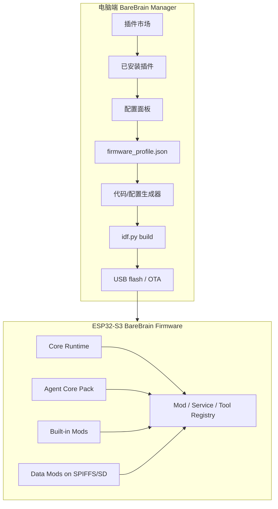

# BareBrain 可插拔 Mod 与电脑端管理面板架构

> 目标：让 BareBrain 具备“电脑端可插拔、设备端稳定运行”的扩展能力。电脑端负责插件市场、安装、配置、构建、烧录和 OTA；ESP32-S3 端运行经过编译、裁剪、校验后的固件能力。

## 1. 总结

BareBrain 可以借鉴 Alice 的微内核思想，但不建议照搬运行时动态插件模型。

推荐形态：

- **电脑端可插拔**：插件市场、启用/禁用、配置、依赖检查、构建、烧录。
- **设备端固件化**：C 语言能力在构建期编译进固件，运行时通过 registry 注册能力。
- **数据能力可热更新**：skill、prompt、persona、cron 模板、知识包等可以写入 SPIFFS/SD。
- **重能力放电脑端**：浏览器自动化、向量库、本地文件索引、桌面操作等通过 Desktop Bridge 运行在电脑端。

一句话：**插件生态放在电脑端，ESP32 端保持小、稳、可控。**

## 2. 当前项目现状

BareBrain 当前已有自然边界：

- `main/agent/`：Agent 循环、上下文构建、工具调用协调
- `main/llm/`：Anthropic/OpenAI Provider、HTTP 请求、工具调用格式转换
- `main/tools/`：工具实现与工具注册
- `main/memory/`：会话历史、长期记忆、异步建库
- `main/bus/`：inbound/outbound 队列
- `main/gateway/`：本地 WebSocket 网关
- `main/channels/feishu/`：飞书通道
- `main/cron/`：定时任务
- `main/heartbeat/`：主动心跳任务
- `main/voice/`：本地 TTS
- `spiffs_data/skills/`：Markdown skill 文件

但当前仍是静态单体：

- `app_main` 手动初始化所有子系统。
- `tool_registry` 直接 include 所有工具头文件，并硬编码注册顺序。
- `context_builder` 硬编码工具说明、行为规则和部分业务提示。
- `skills` 是 Markdown 指令文件，不是可执行 Mod。
- `CMakeLists.txt` 把所有源文件编进同一个固件组件。

第一阶段的核心任务是把“能力注册”和“功能启用”从核心启动逻辑中解耦出来。

## 3. 设计原则

### 3.1 设备端不做任意代码热加载

ESP32-S3 不适合在运行时下载并执行未知 C/JS/C# 插件。

原因：

- 资源有限，Flash、PSRAM、栈空间都要可预测。
- 动态插件崩溃后很难隔离。
- 热重载 FreeRTOS task、timer、HTTP handler、UART driver 的清理复杂。
- 权限边界难以做强。
- 调试和复现成本高。

设备端应优先采用 **构建期插件选择 + 运行时能力注册**。

### 3.2 电脑端承担插件体验

用户真正需要的是：

- 能看插件市场
- 能一键安装插件
- 能启用/禁用插件
- 能配置 API key、GPIO、端口、模型
- 能自动构建固件
- 能 USB 烧录或 OTA 更新

这些应该由电脑端管理器完成。

### 3.3 Core 只管平台能力

长期目标是让 Core 不直接理解具体业务名词，例如：

- Feishu
- WebSocket chat
- web_search
- gpio_write
- tts_say
- cron_add
- weather_get

Core 应只提供：

- 生命周期
- 事件总线
- 服务注册
- 工具注册
- prompt contributor 聚合
- 存储和配置
- 网络基础能力
- 权限校验
- 日志和状态查询

## 4. 总体架构



## 5. 分层说明

### 5.1 Core Runtime

Core Runtime 是最小平台层。

职责：

- 初始化 NVS、SPIFFS、SD、WiFi、事件循环等基础设施
- 管理 Mod 生命周期
- 提供事件总线
- 提供服务注册表
- 提供工具注册表
- 聚合 prompt contributor
- 提供权限校验
- 提供统一日志和状态查询

建议目录：

```text
main/core/
  runtime/
  mod/
  event/
  service/
  permission/
  config/
```

### 5.2 Agent Core Pack

Agent Core Pack 是 BareBrain 的核心 AI 能力，可以作为一个整体保留。

包含：

- Agent ReAct loop
- LLM provider 调用
- session 历史
- 长期记忆
- context builder
- 工具调用协调

建议目录：

```text
main/agent_core/
  agent_loop/
  llm/
  session/
  memory/
  context/
```

第一阶段不建议把 LLM provider、memory、agent loop 全部拆散。先让它们通过 registry 发现工具、prompt 和通道。

### 5.3 Built-in Mods

Built-in Mods 是编译进固件的 C 能力模块。

建议目录：

```text
main/mods/
  channel_ws/
  channel_feishu/
  tool_web_search/
  tool_files/
  tool_memory/
  tool_cron/
  tool_gpio/
  tool_tts/
  service_heartbeat/
  device_twtts/
```

### 5.4 Data Mods

Data Mods 不需要重新编译主固件，可以直接写入 SPIFFS 或 SD。

适合：

- Markdown skill
- persona
- user profile
- prompt 片段
- cron 模板
- 静态知识包
- GPIO policy 配置

当前 `spiffs_data/skills/*.md` 可以演进为 Data Mod。

### 5.5 Desktop Bridge Mods

Desktop Bridge Mods 运行在电脑端，ESP32 通过 WebSocket/RPC 调用。

适合：

- 浏览器自动化
- 本地文件索引
- 向量数据库
- 本地模型
- Git/IDE 集成
- 大文件处理
- 插件市场同步

这样可以保留 ESP32 的轻量性，同时扩展桌面级能力。

## 6. Mod 类型

| 类型 | 是否重编固件 | 运行位置 | 示例 |
| --- | --- | --- | --- |
| `data` | 否 | SPIFFS/SD | skill、persona、prompt pack |
| `tool` | 是 | ESP32 | web_search、weather、file tools |
| `channel` | 是 | ESP32 | WebSocket、Feishu、MQTT |
| `device` | 是 | ESP32 | TTS、屏幕、按钮、传感器 |
| `service` | 是 | ESP32 | heartbeat、cron scheduler |
| `bridge` | 部分需要 | ESP32 + 电脑端 | desktop bridge、browser control |
| `profile` | 否 | 电脑端 | 一组插件组合和配置 |

## 7. 固件 Profile

电脑端管理器不应直接让用户手改源码。它应生成一个固件 Profile。

示例：

```json
{
  "target": "esp32s3",
  "board": "esp32s3-devkit",
  "profile_name": "home-basic",
  "enabled_mods": [
    "agent_core",
    "channel_ws",
    "tool_files",
    "tool_memory",
    "tool_web_search",
    "tool_cron",
    "service_heartbeat",
    "device_twtts"
  ],
  "disabled_mods": [
    "channel_feishu",
    "tool_gpio"
  ],
  "config": {
    "llm.provider": "anthropic",
    "llm.model": "claude-opus-4-5",
    "ws.port": 18789,
    "heartbeat.interval_ms": 1800000
  },
  "secrets_policy": {
    "wifi.password": "nvs",
    "llm.api_key": "nvs",
    "search.api_key": "nvs"
  }
}
```

生成物建议：

- `build/generated/brn_mod_config.h`
- `build/generated/brn_mod_registry.c`
- `build/generated/spiffs_manifest.json`
- `build/generated/profile_summary.md`

## 8. 电脑端管理面板

### 8.1 第一版能力

第一版应优先支持本地插件：

- 读取本地插件目录
- 展示插件列表
- 启用/禁用插件
- 显示权限和依赖
- 编辑配置
- 生成 firmware profile
- 生成代码/配置
- 调用 ESP-IDF 构建
- USB 烧录
- 查看构建日志

### 8.2 第二版能力

第二版再加入市场能力：

- 远程插件索引
- 插件下载和更新
- 版本兼容检查
- checksum 校验
- changelog 展示
- OTA 上传
- 设备状态面板
- SPIFFS data-only 更新

### 8.3 构建与烧录流程

本项目约定：在 `cmd` 窗口运行 `esp` 可进入 ESP-IDF 虚拟环境，然后执行 `idf.py`。

管理器可以封装流程：

```text
选择插件
  -> 校验依赖、冲突、权限、资源
  -> 写入 firmware_profile.json
  -> 生成 brn_mod_registry.c / brn_mod_config.h
  -> 生成 SPIFFS 数据
  -> idf.py build
  -> idf.py -p <PORT> flash
  -> 可选 idf.py -p <PORT> monitor
```

OTA 流程：

```text
idf.py build
  -> 产出 app bin
  -> 管理器连接设备管理接口
  -> 上传固件
  -> 设备校验 OTA 分区
  -> 重启进入新固件
```

## 9. 插件市场索引

插件市场可以先用一个 JSON index 实现。

示例：

```json
{
  "schema": 1,
  "plugins": [
    {
      "id": "weather",
      "name": "Weather Tool",
      "version": "1.0.0",
      "repo": "https://github.com/example/barebrain-mod-weather",
      "archive": "https://github.com/example/barebrain-mod-weather/releases/download/v1.0.0/weather.zip",
      "type": "tool",
      "targets": ["esp32s3"],
      "permissions": ["network"],
      "barebrain_min": "0.1.0",
      "barebrain_max": "0.x",
      "checksum": "sha256:..."
    }
  ]
}
```

## 10. 设备端接口草案

### 10.1 Mod 描述

```c
typedef struct brn_mod {
    const char *id;
    const char *name;
    const char *version;
    const char *const *deps;
    esp_err_t (*init)(void);
    esp_err_t (*start)(void);
    void (*stop)(void);
    esp_err_t (*contribute_prompt)(char *buf, size_t size, size_t *offset);
} brn_mod_t;
```

### 10.2 Tool 注册

```c
esp_err_t brn_tool_register(const brn_tool_t *tool);
esp_err_t brn_tool_unregister(const char *name);
const char *brn_tool_registry_get_tools_json(void);
esp_err_t brn_tool_execute(const char *name, const char *input_json, char *output, size_t output_size);
```

### 10.3 Prompt Contributor

```c
typedef struct {
    const char *mod_id;
    int priority;
    esp_err_t (*build)(char *buf, size_t size, size_t *offset);
} brn_prompt_contributor_t;
```

`context_builder` 应从各 contributor 聚合 prompt，而不是硬编码所有工具说明。

## 11. 权限模型

建议权限：

| 权限 | 说明 |
| --- | --- |
| `network` | 出站 HTTP/HTTPS |
| `storage.read` | 读取 SPIFFS/SD |
| `storage.write` | 写入 SPIFFS/SD |
| `gpio.read` | 读取 GPIO |
| `gpio.write` | 写 GPIO |
| `uart` | 使用 UART |
| `timer` | 创建定时任务 |
| `channel.send` | 发送消息到外部通道 |
| `agent.inject` | 向 Agent 注入消息 |
| `secret.read` | 读取 NVS secret |

最低要求：

- 插件 manifest 必须声明权限。
- 电脑端安装前必须显示高风险权限。
- GPIO/UART/端口冲突必须在构建前检测。
- secret 不写入明文 profile。
- 文件写入路径必须受限。

## 12. 依赖与冲突

插件应声明：

```json
{
  "dependencies": ["core.tool_registry", "core.net"],
  "conflicts": ["other-weather-provider"],
  "requires_config": ["weather.api_key"],
  "resources": {
    "gpio": [17, 18],
    "uart": [1],
    "tasks": 1,
    "psram_bytes_hint": 8192,
    "flash_bytes_hint": 32768
  }
}
```

管理器构建前检查：

- 依赖是否启用
- 冲突插件是否同时启用
- GPIO/UART/端口是否冲突
- 目标芯片是否支持
- 预估 Flash/PSRAM 是否超预算
- 必填配置是否完整

## 13. 迁移路线

### Phase 0：规范和文档

- 定义 Mod 类型
- 定义 manifest schema
- 定义 firmware profile
- 定义生成物路径
- 编写 Mod 开发规范

### Phase 1：静态 Mod Registry

- 增加 `brn_mod_t`
- 增加 Mod 生命周期管理
- 生成静态 registry
- 保持现有行为不变

### Phase 2：工具注册解耦

- 公开工具注册 API
- 每个工具由自己的 Mod 注册
- `tool_registry_init` 不再硬编码所有工具
- `context_builder` 从 registry 生成工具说明

优先迁移顺序：

1. `tool_get_time`
2. `tool_files`
3. `tool_tts`
4. `tool_gpio`
5. `tool_cron`
6. `tool_web_search`
7. `tool_memory`

### Phase 3：Data Mod

- `spiffs_data/skills` 支持 manifest
- 管理器可以添加、删除、更新 skill
- 支持只更新 SPIFFS 数据，不重刷主固件

### Phase 4：电脑端本地管理器

- 本地插件目录
- 启用/禁用
- 配置表单
- 生成 profile
- 调用 `idf.py build`
- 调用 `idf.py flash`

### Phase 5：插件市场

- 远程 index JSON
- 插件下载
- 版本检查
- checksum 校验
- changelog 展示

### Phase 6：OTA 和设备状态

- 局域网设备发现
- 查看固件版本和启用 Mod
- OTA 上传
- 回滚和失败恢复

## 14. 成功标准

架构完成后应满足：

- 新增工具 Mod 不需要修改 `agent_loop`。
- 禁用 Feishu 不需要改 `brn.c`。
- 禁用 GPIO 后，固件不注册 GPIO 工具，prompt 中也不出现 GPIO 能力。
- 添加 Markdown skill 可以通过电脑端写入 SPIFFS。
- 电脑端可以生成明确的 firmware profile。
- 用户可以从管理器构建并烧录。
- 设备可以报告当前启用的 Mod 列表。

## 15. 不建议第一阶段实现

第一阶段不建议做：

- ESP32 端 C 动态库加载
- ESP32 端 Lua/JS 插件热加载
- 完整线上账号系统
- 插件签名全链路
- 把 Agent、LLM、Memory 全部拆散
- 插件绕过 registry 直接操作核心状态

先做可控的静态 Mod 体系，再扩展市场和 OTA。
